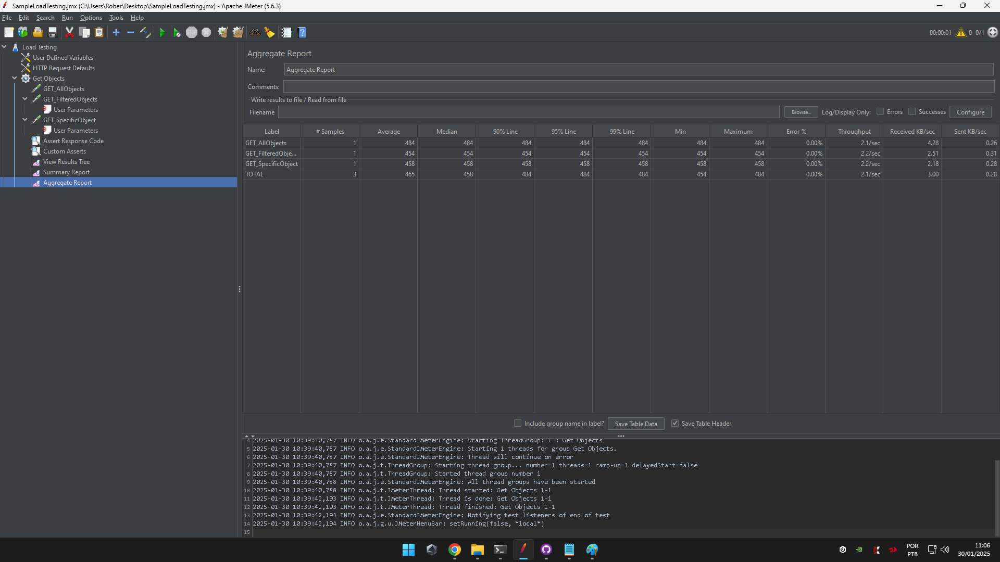

# Sample JMeter Load Testing

The Sample Load Test project separates threads by API endpoints, providing the flexibility to simulate users performing distinct actions across different APIs, thereby reflecting real-world user behavior.

Since the requirements did not specify details such as the number of users, number of executions, or expected response times, those strategies were not implemented in this tests.

## How to run

* Download and Install [Java 17](https://www.oracle.com/java/technologies/javase/jdk17-archive-downloads.html)
* Download and Extract [JMeter 5.6.3](https://jmeter.apache.org/download_jmeter.cgi)
* Inside the JMeter bin folder, run the command line ```jmeter -n -t "JMX_FILE_LOCATION" -l "REPORT_FILE_LOCATION" -e -o "REPORT_FOLDER_LOCATION"```. Be sure to replace the placeholders with the appropriate file and folder paths.
* Once the command has executed, navigate to the index.html file in your specified Report Folder Location to view the Results Dashboard.

#Dashboard


## Evidences




